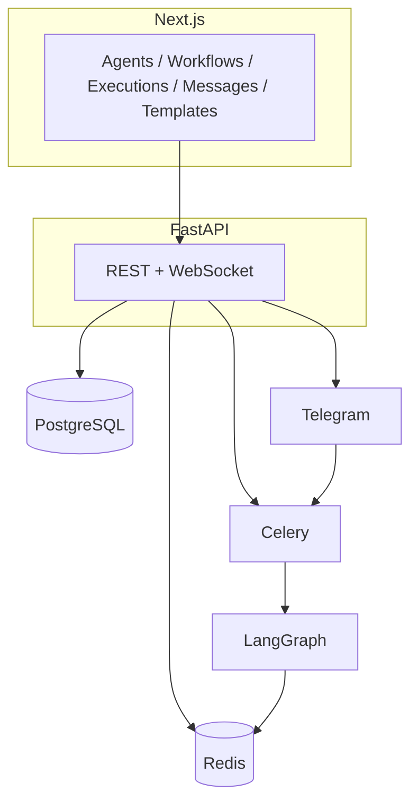

# AI Agent Orchestration Platform

Build **AI agents** (model, tools, memory, guardrails, schedules, channels), run them on a real **LangGraph** runtime, and connect them in **workflows** with conditions and feedback loops. Includes a **Next.js** UI, **FastAPI** API, **PostgreSQL**, **Redis**, **Celery** workers, and **Telegram** as the external chat channel.

**Read first:** [docs/SETUP.md](docs/SETUP.md) (how to run) · [docs/REQUIREMENTS.md](docs/REQUIREMENTS.md) (how this maps to the assignment) · [docs/README.md](docs/README.md) (all docs)

---

## Requirements (summary)

| Area | This project |
| --- | --- |
| **Framework** (OpenClaw / LangGraph / CrewAI / AutoGen / custom) + **README justification** | **LangGraph** — [Runtime choice](#runtime-choice-langgraph) |
| **UI + database + channel** (WhatsApp / Telegram / Slack) | Next.js + PostgreSQL + **Telegram** |
| **One command, local (optional)** | `docker compose up --build` from repo root |
| **Async communication, message history in UI, real execution** | Celery + A2A; `Message` + `/messages`; worker `ainvoke` (not a mock) |
| **Agent CRUD + full config** | API + forms: schedules, memory, skills, rules, guardrails, channels |
| **Visual workflow builder** + conditions + loops | **Workflows → New** or **Edit** in the UI; `content_creation` template loop |
| **≥2 templates** | **3** in `app/agents/templates.py` |
| **Monitoring** (logs, A2A, token/cost) | Execution page + WebSocket |
| **Demo (2+ agents, recording)** | [Demo checklist](#demo-checklist) below |

---

## How to run

1. [Install Docker](https://docs.docker.com/get-docker/).  
2. In the **repo root** (folder with `docker-compose.yml`): `cp backend/.env.example backend/.env` and set `OPENAI_API_KEY`.  
3. `docker compose up --build`  
4. Open **http://localhost:3000** (UI) and **http://localhost:8000/docs** (API).  

**Stop:** `Ctrl+C` or `docker compose down`. **Ports, troubleshooting, no-Docker, Telegram:** [docs/SETUP.md](docs/SETUP.md)

---

## Architecture



- **UI:** SWR, Tailwind — `NEXT_PUBLIC_API_URL`, `NEXT_PUBLIC_WS_URL`  
- **Data:** ORM in `app/models.py`; Redis for memory + live execution pub/sub  
- **Runs:** API enqueues Celery → worker runs LangGraph `ainvoke` and streams events  

Deeper: [docs/ARCHITECTURE.md](docs/ARCHITECTURE.md)

## Runtime choice (LangGraph)

| | |
| --- | --- |
| **Graphs** | `StateGraph`, shared state, one node per agent step |
| **Branching** | `add_conditional_edges` using `outputs` / `iteration` |
| **Reality** | Real LLM + tools in the worker, not the browser |

**Why LangGraph (and not only Crew/AutoGen/OpenClaw here):** workflows are **user-defined graphs** (nodes, edges, conditions, loops) stored in the DB. LangGraph maps that to an explicit `StateGraph`. Crew/AutoGen are strong for fixed agent teams; OpenClaw is a different operating model. Details: [docs/REQUIREMENTS.md](docs/REQUIREMENTS.md).

---

## Pre-built templates

Three multi-agent templates live in `app/agents/templates.py` (research, support, content with critic loop). In the app: **Templates** → **Instantiate**. To add more: add to `TEMPLATES` in that file, rebuild the API (or use hot reload in dev).

## Add another channel (e.g. Slack)

1. `app/messaging/slack.py` (send + inbound handler)  
2. `app/api/routes/slack.py` + `include_router` in `main.py`  
3. Use `channel_config` on the agent; mirror in the UI  
4. Enqueue a Celery task (same pattern as `process_telegram_message`)

## Tests

```bash
cd backend && pip install -r requirements.txt && pytest -q
```

Optional DB test: set `RUN_API_TESTS=1` and `DATABASE_URL` to a running Postgres, then `pytest tests/test_api_live.py -q`. See [docs/SETUP.md](docs/SETUP.md).

## Demo checklist

- [ ] Multi-agent **template** or custom workflow, **Run**, watch **Executions** + live stream.  
- [ ] **Messages** page shows run output.  
- [ ] **Telegram** chat with a Telegram-enabled agent + **screen recording** (link in repo or README is fine).  

## Repository layout (high level)

```
backend/app/
  main.py           # App, CORS, WebSocket
  models.py           # ORM
  api/routes/         # REST
  agents/
    runtime.py        # LangGraph
    tools.py          # Tools + A2A
    memory.py
    templates.py
  workers/            # Celery + graph execution
  messaging/telegram.py
frontend/src/app/     # UI routes
```

## License

Provided for assignment / evaluation.
