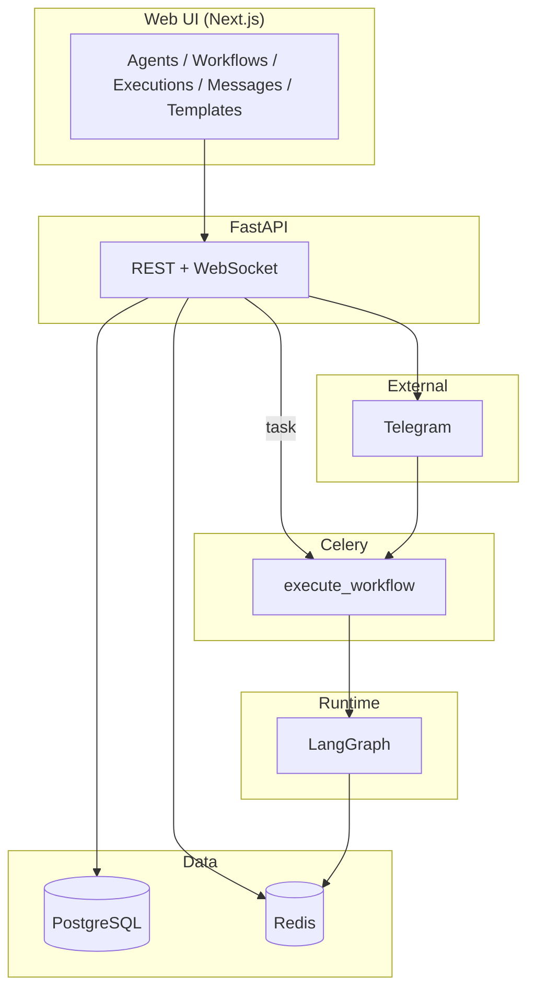

# Architecture

## Diagram

## What each part does

| Part | Role |
| --- | --- |
| **Next.js** | Agent and workflow UIs, execution screen with WebSocket live stream, messages, templates. |
| **FastAPI** | HTTP API, OpenAPI, and WebSocket handlers that read Redis for execution `execution:{id}`. |
| **PostgreSQL** | Agents, workflows (nodes/edges), executions, logs, messages. |
| **Redis** | Celery queue, short agent memory, pub/sub for log/A2A events to the WebSocket. |
| **Celery** | Runs `execute_workflow` (LangGraph) and `process_telegram_message`; `celery_beat` runs schedule checks. |
| **LangGraph** | `StateGraph` from DB workflow, `ainvoke`, tools — see `agents/runtime.py`. |
| **Telegram** | Webhook → API → background task, same `Agent` config as workflows. |

## One workflow run (short)

1. **POST** `/api/executions` saves a row and queues `execute_workflow`.  
2. The **worker** loads the graph, calls **`ainvoke`**, writes logs, publishes to Redis, updates tokens/cost.  
3. The **browser** WebSocket on `/executions/{id}` receives log and A2A events in real time.

A2A tool: see `tools.py` — events also stored as `Message` rows with `channel=a2a`.

**Read more:** [Runtime choice in README](../README.md#runtime-choice-langgraph) and **Repository layout** in the same file.
